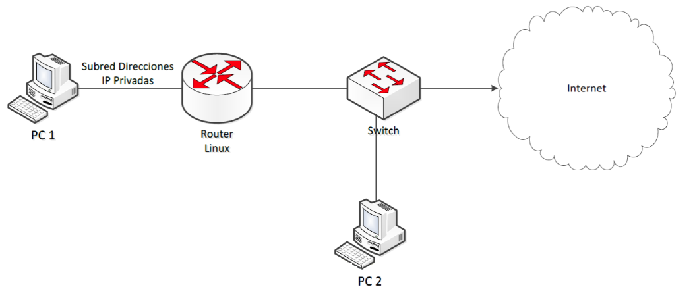

# Laboratorio 1
## Problema 1
Hacer un script en **BASH** o **Python** que lea la información del comando **ifconfig** y entregue la siguiente información de una y sólo una tarjeta de red que esté activa (cableada o inalámbrica):

* Dirección MAC.
* Dirección IP.
* Número de paquetes recibidos.
* Número de paquetes transmitidos.

Además, utilice el comando date para agregar a la información anterior la fecha y hora de la medición de los datos. Finalmente, guarde estos datos en un archivo y grafique resultados de sus mediciones versus tiempo.

## Problema 2
Hacer un script en **Python**, **Java**, **Matlab** y otro lenguaje de programación que comunique dos computadores conectados en red. En este script se debe emular un sistema cliente-servidor, donde el servidor está atento escuchando solicitudes de conexión de un cliente. Cuando el servidor recibe una conexión, éste debe imprimir un mensaje en pantalla que diga:

**YYYY/MM/DD** ; **HH:MM:SS**; Conexión recibida desde **IP**

Donde **YYYY/MM/DD** es la fecha (año/mes/día) en que se hizo la conexión, **HH:MM:SS** es la hora (hora/minutos/segundos) en que se hizo la conexión e **IP** es la dirección IP del nodo cliente. Se pide además guardar estos mensajes en un archivo de registro (log)

# Laboratorio 4

## Problema 2

Montar el siguiente set-up en el laboratorio:

 

y diseñar y/o configurar:

* Las direcciones IP, máscara de subred y puerta de enlace en cada PC.
* Las reglas de enmascaramiento (NAT) que permiten la comunicación entre ambos PC e Internet.
* Servidor DHCP en el Router que permita la configuración automática de la red de direcciones IP privadas.